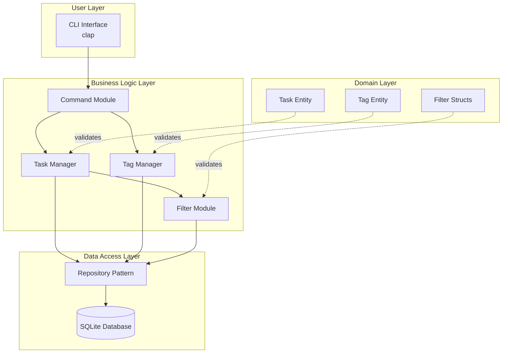
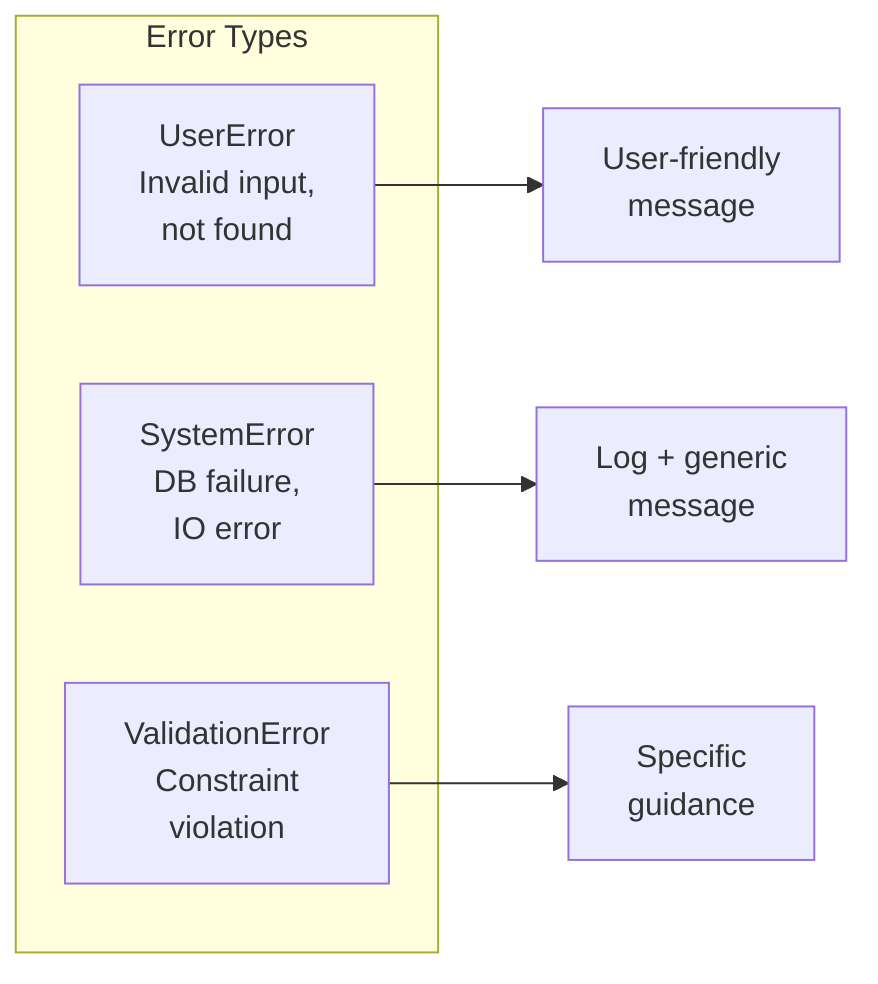
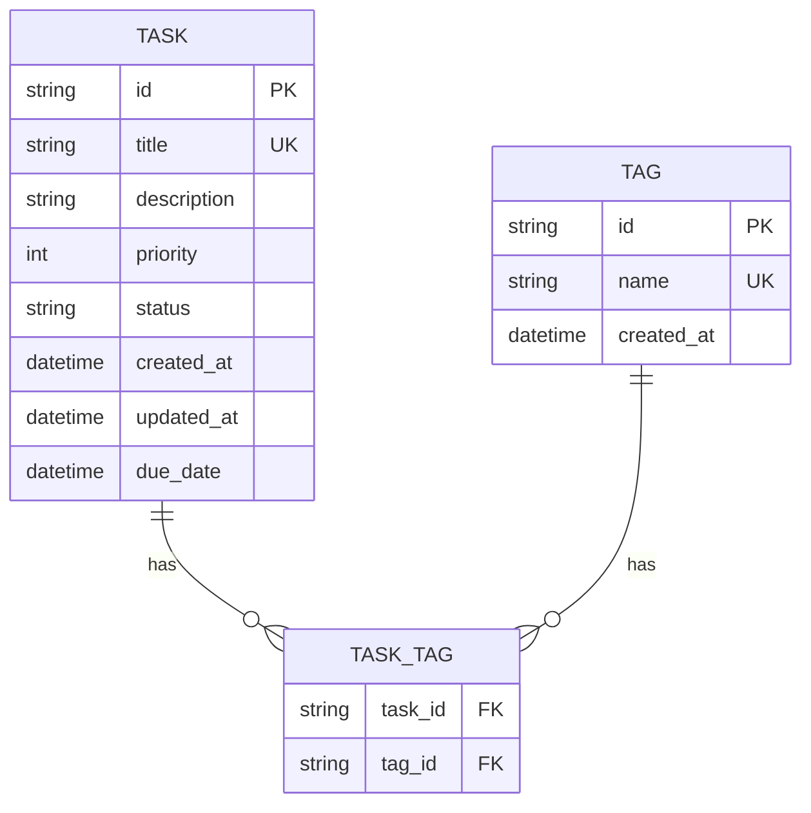

# Product Requirements Document (PRD)
# Rust CLI Task Manager

**Version:** 1.0  
**Date:** 2026-02-28  
**Status:** Draft

---

## 1. Overview and Vision

### 1.1 Product Overview

**TaskForge** is a command-line interface (CLI) task management application built in Rust, designed to provide fast, efficient, and distraction-free task organization. Inspired by Todoist's core functionality, TaskForge brings powerful task management capabilities directly to the terminal with minimal resource footprint.

### 1.2 Vision Statement

To create a lightweight, high-performance CLI task manager that enables developers and power users to organize their tasks efficiently without leaving their terminal environment.

### 1.3 Target Users

- Software developers and DevOps engineers
- Power users who prefer CLI over GUI applications
- Users who want fast, keyboard-driven task management
- Individuals seeking a minimal, distraction-free task organizer

### 1.4 Problem Statement

Existing CLI task managers either lack essential features (tagging, filtering) or are too complex for quick daily use. GUI applications like Todoist are excellent but require context switching away from the terminal.

### 1.5 Success Metrics

- Task creation takes less than 2 seconds from command to stored
- Filter operations return results in under 500ms
- Application binary size under 10MB
- Zero runtime dependencies (static binary)

---

## 2. User Stories and Use Cases

### 2.1 User Stories

| ID | User Story | Priority |
|----|------------|----------|
| US-1 | As a user, I want to create a new task with a title so I can track my work | Must Have |
| US-2 | As a user, I want to add tags to tasks so I can organize them by category | Must Have |
| US-3 | As a user, I want to mark tasks as complete/incomplete so I can track progress | Must Have |
| US-4 | As a user, I want to delete tasks I no longer need | Must Have |
| US-5 | As a user, I want to update task details (title, priority, tags) | Must Have |
| US-6 | As a user, I want to view all my tasks in a formatted list | Must Have |
| US-7 | As a user, I want to filter tasks by status (completed/incomplete) | Must Have |
| US-8 | As a user, I want to filter tasks by priority level | Must Have |
| US-9 | As a user, I want to filter tasks by tags | Must Have |
| US-10 | As a user, I want to filter tasks by due date | Should Have |
| US-11 | As a user, I want to list all my tags for reference | Should Have |
| US-12 | As a user, I want to edit tasks interactively | Should Have |

### 2.2 Use Cases

#### Use Case 1: Quick Task Capture
**Scenario:** User is working in terminal and remembers they need to buy groceries
1. User types `task add "Buy groceries"`
2. System creates task with auto-generated ID
3. System confirms task was created with ID display

#### Use Case 2: Project-Based Organization
**Scenario:** User has multiple projects and wants to tag tasks accordingly
1. User creates task: `task add "Fix login bug" --tag bug --tag login`
2. User creates task: `task add "Update documentation" --tag docs`
3. User filters by list --tag bug`

#### Use Case 3: Daily Workflow Management
**Scenario:** tag: `task User wants to see only incomplete tasks for today
1. User marks yesterday's completed tasks
2. User runs: `task list --status incomplete`
3. User focuses on remaining work

#### Use Case 4: Priority-Based Focus
**Scenario:** User wants to work on high-priority items first
1. User creates tasks with priorities: `task add "Critical bug" --priority 1`
2. User lists tasks sorted by priority: `task list --sort priority`
3. User completes high-priority items first

---

## 3. Functional Requirements

### 3.1 Task Management (CRUD)

#### 3.1.1 Create Task
- **FR-001:** User can create a task with a required title
- **FR-002:** User can optionally set a description for the task
- **FR-003:** User can assign priority (1-4, where 1 is highest)
- **FR-004:** User can assign one or more tags to a task
- **FR-005:** User can optionally set a due date
- **FR-006:** System auto-generates unique task ID (UUID)
- **FR-007:** System auto-sets creation timestamp
- **FR-008:** Default status for new tasks is "incomplete"

#### 3.1.2 Read Tasks
- **FR-009:** User can view all tasks in a formatted table/list
- **FR-010:** User can view a single task by ID
- **FR-011:** User can view tasks with pagination (configurable page size)
- **FR-012:** User can sort tasks by: creation date, priority, due date, title
- **FR-013:** User can sort in ascending or descending order

#### 3.1.3 Update Task
- **FR-014:** User can update task title
- **FR-015:** User can update task description
- **FR-016:** User can update task priority
- **FR-017:** User can add tags to existing task
- **FR-018:** User can remove tags from existing task
- **FR-019:** User can update task due date
- **FR-020:** User can mark task as complete/incomplete
- **FR-021:** User can update task via interactive editor

#### 3.1.4 Delete Task
- **FR-022:** User can delete a task by ID
- **FR-023:** System prompts for confirmation before deletion
- **FR-024:** User can force-delete without confirmation (optional flag)

### 3.2 Tagging System

- **FR-025:** User can create tags (implicitly when added to tasks)
- **FR-026:** User can view all existing tags
- **FR-027:** User can delete unused tags
- **FR-028:** User can rename existing tags
- **FR-029:** Tags are case-insensitive in queries but preserve display case
- **FR-030:** User can see tag usage count

### 3.3 Filtering Capabilities

- **FR-031:** Filter by status: `completed` or `incomplete`
- **FR-032:** Filter by priority: 1, 2, 3, or 4
- **FR-033:** Filter by single tag
- **FR-034:** Filter by multiple tags (AND logic)
- **FR-035:** Filter by due date: before, after, on specific date
- **FR-036:** Filter by date range
- **FR-037:** Combine multiple filters in single query
- **FR-038:** Clear/reset filters to show all tasks

### 3.4 Configuration

- **FR-039:** Store configuration in `~/.taskforge/config.toml`
- **FR-040:** Configurable default priority for new tasks
- **FR-041:** Configurable date format (ISO 8601, US, EU)
- **FR-042:** Configurable output format (table, plain, JSON)
- **FR-043:** Configurable editor for interactive editing

---

## 4. Technical Architecture

### 4.1 System Architecture Overview



### 4.2 Technology Stack

| Component | Technology | Version |
|-----------|------------|---------|
| Language | Rust | 1.75+ |
| CLI Parsing | clap | 4.x |
| Database | SQLite (rusqlite) | 0.31.x |
| Date/Time | chrono | 0.4.x |
| Serialization | serde | 1.x |
| UUID Generation | uuid | 1.x |
| Logging | tracing | 0.1.x |
| Testing | tokio, mockall | latest |

### 4.3 Module Design

#### 4.3.1 CLI Module (`src/cli.rs`)
- Command-line argument parsing
- User input validation
- Output formatting and display

#### 4.3.2 Command Module (`src/commands.rs`)
- Business logic orchestration
- Error handling and user feedback

#### 4.3.3 Task Manager (`src/task.rs`)
- Task CRUD operations
- Task validation
- State management

#### 4.3.4 Tag Manager (`src/tag.rs`)
- Tag CRUD operations
- Tag-task relationship management

#### 4.3.5 Filter Module (`src/filter.rs`)
- Filter parsing and validation
- Query construction
- Result sorting

#### 4.3.6 Repository (`src/repository.rs`)
- Database operations abstraction
- Connection management
- Query execution

#### 4.3.7 Models (`src/models.rs`)
- Data structures
- Serialization/deserialization

### 4.4 Error Handling Strategy



- **UserError:** Invalid IDs, empty inputs - show helpful message
- **SystemError:** Database issues, file problems - log details, show generic error
- **ValidationError:** Constraint violations - explain what's wrong

---

## 5. Data Models

### 5.1 Entity Relationship Diagram



### 5.2 Task Entity

```rust
struct Task {
    /// Unique identifier (UUID v4)
    id: String,
    
    /// Task title (required, max 500 chars)
    title: String,
    
    /// Optional detailed description
    description: Option<String>,
    
    /// Priority 1-4 (1 = highest)
    priority: Priority,
    
    /// Task status
    status: Status,
    
    /// Creation timestamp
    created_at: DateTime<Utc>,
    
    /// Last update timestamp
    updated_at: DateTime<Utc>,
    
    /// Optional due date
    due_date: Option<DateTime<Utc>>,
}

enum Priority {
    P1 = 1,  // Critical
    P2 = 2,  // High
    P3 = 3,  // Medium
    P4 = 4,  // Low
}

enum Status {
    Incomplete,
    Completed,
}
```

### 5.3 Tag Entity

```rust
struct Tag {
    /// Unique identifier (UUID v4)
    id: String,
    
    /// Tag name (unique, case-insensitive)
    name: String,
    
    /// Creation timestamp
    created_at: DateTime<Utc>,
}
```

### 5.4 Database Schema

```sql
-- Tasks table
CREATE TABLE tasks (
    id TEXT PRIMARY KEY,
    title TEXT NOT NULL,
    description TEXT,
    priority INTEGER NOT NULL DEFAULT 3,
    status TEXT NOT NULL DEFAULT 'incomplete',
    created_at TEXT NOT NULL,
    updated_at TEXT NOT NULL,
    due_date TEXT
);

-- Tags table
CREATE TABLE tags (
    id TEXT PRIMARY KEY,
    name TEXT NOT NULL UNIQUE COLLATE NOCASE,
    created_at TEXT NOT NULL
);

-- Task-Tag relationship (many-to-many)
CREATE TABLE task_tags (
    task_id TEXT NOT NULL REFERENCES tasks(id) ON DELETE CASCADE,
    tag_id TEXT NOT NULL REFERENCES tags(id) ON DELETE CASCADE,
    PRIMARY KEY (task_id, tag_id)
);

-- Indexes for performance
CREATE INDEX idx_tasks_status ON tasks(status);
CREATE INDEX idx_tasks_priority ON tasks(priority);
CREATE INDEX idx_tasks_due_date ON tasks(due_date);
CREATE INDEX idx_tasks_created_at ON tasks(created_at);
CREATE INDEX idx_tags_name ON tags(name COLLATE NOCASE);
```

### 5.5 Filter Struct

```rust
struct TaskFilter {
    pub status: Option<Status>,
    pub priority: Option<Priority>,
    pub tags: Vec<String>,           // AND logic - must have ALL tags
    pub due_before: Option<DateTime<Utc>>,
    pub due_after: Option<DateTime<Utc>>,
    pub due_on: Option<NaiveDate>,
    pub created_after: Option<DateTime<Utc>>,
    pub created_before: Option<DateTime<Utc>>,
    pub search: Option<String>,      // Search in title/description
}

struct TaskSort {
    pub field: SortField,           // priority, created_at, due_date, title
    pub direction: SortDirection,   // asc, desc
}
```

---

## 6. CLI Commands Specification

### 6.1 Command Structure

```
task <command> [options] [arguments]
```

### 6.2 Global Options

| Option | Short | Description | Default |
|--------|-------|-------------|---------|
| `--config` | `-c` | Path to config file | `~/.taskforge/config.toml` |
| `--help` | `-h` | Show help message | - |
| `--version` | `-V` | Show version | - |

### 6.3 Commands

#### 6.3.1 Add Task

```bash
# Basic usage
task add "Task title"

# With all options
task add "Task title" \
    --description "Detailed description" \
    --priority 1 \
    --tag work \
    --tag urgent \
    --due 2026-03-15
```

| Argument/Option | Required | Description |
|-----------------|----------|-------------|
| `TITLE` | Yes | Task title (quoted if contains spaces) |
| `--description`, `-d` | No | Task description |
| `--priority`, `-p` | No | Priority 1-4 (default: 3) |
| `--tag`, `-t` | No | Tag(s) to assign (can repeat) |
| `--due` | No | Due date (ISO 8601 format) |

#### 6.3.2 List Tasks

```bash
# List all tasks
task list

# List incomplete tasks only
task list --status incomplete

# List by priority (highest first)
task list --sort priority --desc

# Filter by tag
task list --tag work

# Filter by multiple tags (AND)
task list --tag work --tag urgent

# Filter by date
task list --due-before 2026-03-01
task list --due-after 2026-02-01
task list --due 2026-02-28

# Combined filters
task list --status incomplete --priority 2 --tag work

# Plain output format
task list --format plain
```

| Option | Short | Description | Default |
|--------|-------|-------------|---------|
| `--status`, `-s` | No | Filter by status (completed/incomplete) | All |
| `--priority`, `-p` | No | Filter by priority (1-4) | All |
| `--tag`, `-t` | No | Filter by tag(s) | All |
| `--due` | No | Filter by due date (exact match) | - |
| `--due-before` | No | Filter by due date before | - |
| `--due-after` | No | Filter by due date after | - |
| `--sort` | No | Sort field (priority/created/due/title) | created |
| `--desc` | No | Sort descending | false |
| `--format`, `-f` | No | Output format (table/plain/json) | table |
| `--limit`, `-l` | No | Max results to show | 50 |

#### 6.3.3 Get Task Details

```bash
# View single task
task get 550e8400-e29b-41d4-a716-446655440000

# View in JSON format
task get 550e8400-e29b-41d4-a716-446655440000 --format json
```

| Argument/Option | Required | Description |
|-----------------|----------|-------------|
| `ID` | Yes | Task UUID |
| `--format`, `-f` | No | Output format (table/plain/json) | table |

#### 6.3.4 Update Task

```bash
# Update title
task update 550e8400-e29b-41d4-a716-446655440000 --title "New title"

# Update description
task update 550e8400-e29b-41d4-a716-446655440000 --description "New desc"

# Update priority
task update 550e8400-e29b-41d4-a716-446655440000 --priority 1

# Mark as complete
task update 550e8400-e29b-41d4-a716-446655440000 --complete

# Mark as incomplete
task update 550e8400-e29b-41d4-a716-446655440000 --incomplete

# Add tags
task update 550e8400-e29b-41d4-a716-446655440000 --add-tag work

# Remove tags
task update 550e8400-e29b-41d4-a716-446655440000 --remove-tag personal

# Interactive edit
task update 550e8400-e29b-41d4-a716-446655440000 --edit
```

| Argument/Option | Required | Description |
|-----------------|----------|-------------|
| `ID` | Yes | Task UUID |
| `--title`, `-t` | No | New title |
| `--description`, `-d` | No | New description |
| `--priority`, `-p` | No | New priority (1-4) |
| `--complete`, `-c` | No | Mark as complete |
| `--incomplete` | No | Mark as incomplete |
| `--add-tag` | No | Add tag(s) |
| `--remove-tag` | No | Remove tag(s) |
| `--due` | No | Set/update due date |
| `--edit`, `-e` | No | Open in interactive editor |

#### 6.3.5 Delete Task

```bash
# Delete task (with confirmation)
task delete 550e8400-e29b-41d4-a716-446655440000

# Delete without confirmation
task delete 550e8400-e29b-41d4-a716-446655440000 --force
```

| Argument/Option | Required | Description |
|-----------------|----------|-------------|
| `ID` | Yes | Task UUID |
| `--force`, `-f` | No | Skip confirmation |

#### 6.3.6 Tag Management

```bash
# List all tags
task tag list

# List tags with task counts
task tag list --verbose

# Rename a tag
task tag rename oldname newname

# Delete unused tag
task tag delete tagname
```

#### 6.3.7 Configuration

```bash
# Show current config
task config show

# Set config value
task config set default_priority 2

# Set date format
task config set date_format iso8601
```

### 6.4 Output Formats

#### Table Format (Default)
```
┌─────────────────────────────────────────────────────────────────────┐
│ Tasks                                                Feb 28, 2026  │
├────────┬──────────────────────────┬─────────┬──────────┬───────────┤
│ ID     │ Title                    │ Prio    │ Status   │ Due Date  │
├────────┼──────────────────────────┼─────────┼──────────┼───────────┤
│ a1b2c3 │ Fix login bug            │ P1      │ ☐        │ 2026-03-01│
│ d4e5f6 │ Update documentation     │ P3      │ ☑        │ -         │
│ g7h8i9 │ Review PR #42            │ P2      │ ☐        │ 2026-02-28│
└────────┴──────────────────────────┴─────────┴──────────┴───────────┘
Total: 3 tasks (1 completed)
```

#### Plain Format
```
[a1b2c3] P1 ☐ Fix login bug (due: 2026-03-01) [tags: bug, login]
[d4e5f6] P3 ☑ Update documentation
[g7h8i9] P2 ☐ Review PR #42 (due: 2026-02-28) [tags: review]
```

#### JSON Format
```json
{
  "tasks": [
    {
      "id": "a1b2c3",
      "title": "Fix login bug",
      "priority": 1,
      "status": "incomplete",
      "due_date": "2026-03-01T00:00:00Z",
      "tags": ["bug", "login"]
    }
  ],
  "total": 3,
  "completed": 1
}
```

---

## 7. Configuration and Persistence

### 7.1 Configuration File

Location: `~/.taskforge/config.toml`

```toml
# TaskForge Configuration

# Default values for new tasks
[defaults]
default_priority = 3
default_status = "incomplete"

# Date and time settings
[datetime]
date_format = "iso8601"  # Options: iso8601, us (MM/DD/YYYY), eu (DD/MM/YYYY)
time_format = "24h"      # Options: 24h, 12h

# Output preferences
[output]
format = "table"         # Options: table, plain, json
page_size = 50
show_completed_count = true

# Editor for interactive editing
[editor]
program = "vim"          # Or: nano, code, etc.
args = []

# Database location
[database]
path = "~/.taskforge/data.db"

# Logging
[logging]
level = "info"           # Options: trace, debug, info, warn, error
file = "~/.taskforge/logs/taskforge.log"
```

### 7.2 Database Storage

- **Location:** `~/.taskforge/data.db` (SQLite)
- **Backup:** Manual copy of `.db` file
- **Migration:** Built-in migration system for schema updates

### 7.3 Data Directory Structure

```
~/.taskforge/
├── config.toml          # User configuration
├── data.db              # SQLite database
├── logs/
│   └── taskforge.log    # Application logs
└── history.txt          # Command history (optional)
```

---

## 8. Non-Functional Requirements

### 8.1 Performance Requirements

- Task creation: < 100ms
- Task listing (1000 tasks): < 500ms
- Filtering: < 300ms
- Application startup: < 200ms

### 8.2 Reliability Requirements

- Graceful handling of database corruption (with backup recovery)
- Atomic operations for critical updates
- No data loss on unexpected termination (SQLite transactions)

### 8.3 Usability Requirements

- All commands support `--help`
- Clear error messages with suggestions
- Tab completion for shell (optional future feature)
- Keyboard navigation in interactive mode

### 8.4 Security Considerations

- File permissions: 0600 for config and database
- No sensitive data logging
- Input sanitization for all user inputs

---

## 9. Future Considerations (Out of Scope)

The following features are considered for future versions but are NOT in scope for v1.0:

- Recurring tasks
- Subtasks/Task hierarchies
- Multiple projects/workspaces
- Task sharing/collaboration
- Cloud sync
- Reminders/notifications
- Rich text descriptions (markdown)
- Task comments
- Labels (vs Tags distinction)
- Priority levels beyond 1-4

---

## 10. Appendix

### 10.1 Exit Codes

| Code | Meaning |
|------|---------|
| 0 | Success |
| 1 | General error |
| 2 | Invalid arguments |
| 3 | Task not found |
| 4 | Database error |
| 5 | Configuration error |

### 10.2 Environment Variables

| Variable | Description |
|----------|-------------|
| `TASKFORGE_CONFIG` | Override config file path |
| `TASKFORGE_DATA_DIR` | Override data directory |
| `TASKFORGE_LOG_LEVEL` | Override log level |

### 10.3 Keyboard Shortcuts (Interactive Mode)

| Shortcut | Action |
|----------|--------|
| `j/k` or `↓/↑` | Navigate |
| `Enter` | Select |
| `Space` | Toggle complete |
| `e` | Edit |
| `d` | Delete |
| `q` | Quit |

---

## 11. Revision History

| Version | Date | Author | Changes |
|---------|------|--------|---------|
| 1.0 | 2026-02-28 | TaskForge Team | Initial PRD |
